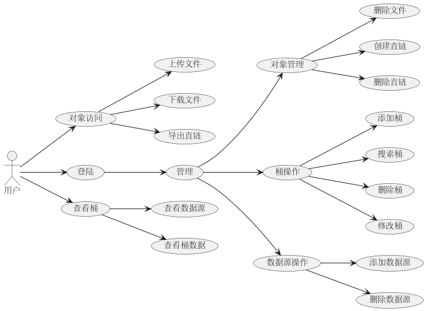

# 存储乐事
一个简单的个人文件存储工具，旨在能否方便的存储个人文件并简单分享。  
能够构建一个私人的云存储服务，也可以实现一个小圈子文件分享站。

## 简介
  
存储乐事构建了一套独立的对象存储服套件，依托于MinIO的存储服务和特性，项目的搭建并不困难。
由于项目采用了前后端分离的结构，所以可以快乐的将服务部署在不同的服务器上，单独部署更加方便。 

Storage Delight 是一个用于构建个人网盘或云盘的项目，旨在提供高效的存储和管理解决方案。该项目由三个主要部分组成：前端、后端和对象存储服务。

- **前端**：用户通过前端界面可以进行各种操作，如管理存储桶（bucket）和对象（object），以及创建和分享直链等功能。

- **后端**：后端负责处理前端请求，并与对象存储服务进行交互，以完成对存储桶和对象的各种操作。

- **对象存储服务**：使用 Minio 作为对象存储服务，提供可靠的存储解决方案，支持文件的上传、下载、删除等操作。

### 功能概述

#### **用户管理**
- **登录**：用户可以通过登录功能访问系统。
- **查看存储桶**：用户可以查看系统中的存储桶。

#### **对象访问**
- **上传文件**：用户可以将文件上传到指定的存储桶中。
- **下载文件**：用户可以从存储桶中下载文件。
- **导出直链**：用户可以生成文件的直链以便于分享。

#### **对象管理**
- **删除文件**：用户可以删除存储桶中的文件。
- **创建直链**：用户可以为文件创建直链。
- **删除直链**：用户可以删除已创建的直链。

#### **存储桶操作**
- **添加存储桶**：用户可以创建新的存储桶。
- **搜索存储桶**：用户可以根据条件搜索存储桶。
- **删除存储桶**：用户可以删除不再需要的存储桶。
- **修改存储桶**：用户可以修改存储桶的属性。
- **查看存储桶数据**：用户可以查看存储桶中的数据。
- **查看数据源**：用户可以查看与存储桶关联的数据源。

#### **数据源操作**
- **添加数据源**：用户可以添加新的数据源。
- **删除数据源**：用户可以删除不再需要的数据源。

---

## 项目结构
- storage_delight:
  - application: 桌面客户端
  - core: 存储核心
  - server: 存储服务器
  - doc: 项目文档
  - vcpkg: 第三方库(sub module)

## 功能实现
### storage_delight::core
  - [x] BucketExists
  - [x] ComposeObject
  - [x] CopyObject
  - [x] DeleteBucketEncryption
  - [x] DeleteBucketLifecycle
  - [x] DeleteBucketNotification
  - [x] DeleteBucketPolicy
  - [x] DeleteBucketReplication
  - [x] DeleteBucketTags
  - [x] DeleteObjectLockConfig
  - [x] DeleteObjectTags
  - [x] DisableObjectLegalHold
  - [x] DownloadObject
  - [x] EnableObjectLegalHold
  - [x] GetBucketEncryption
  - [x] GetBucketLifecycle
  - [x] GetBucketNotification
  - [x] GetBucketPolicy
  - [x] GetBucketReplication
  - [x] GetBucketTags
  - [x] GetBucketVersioning
  - [x] GetObject
  - [x] GetObjectLockConfig
  - [x] GetObjectProgress
  - [x] GetObjectRetention
  - [x] GetObjectTags
  - [x] GetPresignedObjectUrl
  - [ ] GetPresignedPostFormData
  - [x] IsObjectLegalHoldEnabled
  - [x] ListBuckets
  - [x] ListenBucketNotification
  - [x] ListObjects
  - [x] MakeBucket
  - [x] PutObject
  - [ ] PutObjectProgress
  - [ ] RemoveBucket
  - [ ] RemoveObject
  - [ ] RemoveObjects
  - [ ] SelectObjectContent
  - [ ] SetBucketEncryption
  - [ ] SetBucketLifecycle
  - [ ] SetBucketNotification
  - [ ] SetBucketPolicy
  - [ ] SetBucketReplication
  - [ ] SetBucketTags
  - [ ] SetBucketVersioning
  - [ ] SetObjectLockConfig
  - [ ] SetObjectRetention
  - [ ] SetObjectTags
  - [ ] StatObject
  - [ ] UploadObject