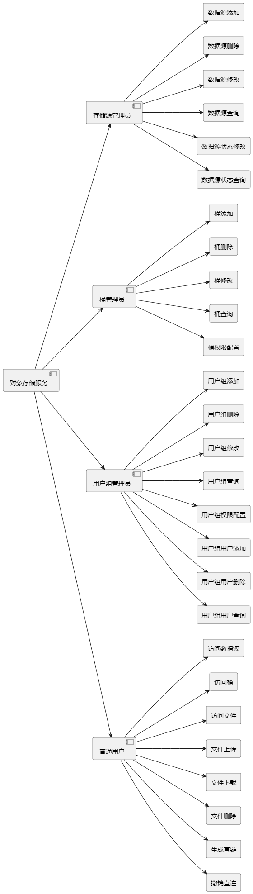

## 研究类型：Web类
## 课题名称：基于MinIO的高效安全对象存储服务的设计与实现

## 设计基本内容
### 1. 目的要求
本课题基于MinIO对象存储核心架构，旨在解决存储服务中数据存储的效率问题，提升存储服务性能，提升存储服务可用性。使用AWS标准交互接口，实现逻辑层和存储层解耦，也提高了存储服务器的扩展性。为数据存储和使用增加便捷性、提升安全性。

### 2.解决的问题
在当前市场上，尽管存在多种对象存储服务，但它们的接口实现往往存在显著差异，这给普通用户带来了诸多使用障碍。用户在使用网盘或网络附加存储（NAS）时，常常面临流量限制、存储空间限制及搭建过程复杂等问题。此外，对于团队合作而言，若每个成员的终端或服务器都作为独立的存储服务器，资源调度和管理将变得极为困难。
本项目旨在解决这些问题，通过在可访问的终端上部署MinIO服务核心，用户可以通过桌面应用程序选择连接到特定的Storage Delight后端，后端再与这些MinIO服务核心进行连接。这种设计不仅简化了用户的操作流程，还提高了存储资源的利用效率，确保团队成员能够方便地共享和管理数据，从而提升整体工作效率和数据安全性。

### 3.创新点
1. 接口标准化：项目采用AWS S3标准接口，使用户能够无缝连接各种支持S3的工具和应用程序。这种接口标准化大大降低了用户的使用门槛，提高了系统的兼容性和可扩展性。
2. 前后端分离：Storage Delight采用前后端分离的架构设计，将逻辑层与存储层进行解耦。这种架构不仅提高了系统的扩展性，还使得前端和后端可以独立部署在不同的服务器上，大大提升了系统的灵活性和可维护性。
分布式部署：项目支持MinIO的分布式部署方式，用户可以根据需求灵活添加存储节点。这种分布式架构不仅提高了系统的可扩展性，还确保了数据的高可用性和容错性。
3. 安全性：Storage Delight继承了MinIO的安全特性，如数据加密、访问控制和身份管理等。这些安全机制确保了用户数据的完整性和隐私性，为用户提供了一个安全可靠的存储环境。
4. 易用性：项目提供了简单易用的桌面应用程序，用户可以通过该程序方便地管理存储桶和对象。此外，项目还支持创建和分享直链等功能，进一步提升了用户体验。

### 4. 主要研究内容和目标人群
1. **技术架构**  
本项目的后端采用C++20，并使用Drogon作为Web服务器，提供高性能的请求处理能力。
前端使用Next.js框架，除了能够在浏览器中运行之外，还能够提高程序扩展性能。
后端使用MongoDB进行数据源、角色等配置的存储。
整体架构设计采用前后端分离的模式，使得系统的各个组件可以独立开发和部署，提升了灵活性与可维护性。

2. **用户界面设计**  
用户界面设计注重简洁与直观，前端界面通过NextJs构建，提供友好的操作体验。
用户可以轻松管理存储桶和对象，进行文件的上传、下载和删除操作。界面设计遵循用户体验原则，确保用户在使用过程中能够快速上手，减少学习成本。

3. **用户流程设计**  
用户流程设计旨在提供流畅的操作体验。
用户通过桌面应用程序连接到Storage Delight后端，后端会根据用户的选择连接到相应的MinIO服务核心。
整个流程包括登录、选择存储桶、上传文件、管理对象等步骤，每一步都经过精心设计，以确保用户能够顺利完成操作。

4. **数据管理**  
在数据管理方面，Storage Delight利用MinIO的对象存储特性，支持分块存储和纠删码技术，确保数据的安全性和可靠性。
通过将多个MinIO存储源分布式部署，可以实现数据冗余和容错，提升系统的可用性和容错性。
此外在逻辑上可将多个存储源合并为一个存储介质，从而实现对数据的透明管理。
项目还实现了版本控制和生命周期管理功能，使得用户可以方便地管理文件的不同版本，并根据需求自动执行数据的迁移和删除操作。

5. **应用场景与目标人群**  
Storage Delight适用于个人用户、中小型企业以及开发团队。
个人用户可以使用该系统搭建私有云存储，方便地管理个人文件；
中小型企业则可以利用该系统进行团队协作和数据共享；
开发团队可以将Storage Delight集成到项目中，快速实现对象存储功能。
通过这些设计与技术，Storage Delight旨在为用户提供一个高效、安全且易于使用的对象存储解决方案。

## 用户和功能模块
### 用户分类
1. 管理员
    描述：作为系统的最高管理者,负责整体的系统配置和用户管理。  
   1. 存储源管理员 (Source Admin)：
       - 功能：负责管理多个数据源,包括添加、删除和配置数据源的逻辑整合。可以将不同的数据源整合为一个存储组。
       - 权限：能够设置存储组的访问权限。
   2. 桶管理员 (Bucket Admin)：
       - 功能：负责管理分配给自己的存储桶,执行桶的创建、删除、以及对桶内数据的操作。
      - 权限：可以设置普通用户对存储桶的访问权限。
   3. 用户组管理员 (Group Admin)：
      - 功能：负责创建和管理用户组,并为用户分配到相应的组。
      - 权限：可以设置用户组的权限,包括对存储桶的访问权限和操作权限。
2. 普通用户
   - 描述：系统的最终用户,普通用户在获得权限后可以访问和操作特定的存储桶。
   - 权限：
     - 在获得权限的存储桶内进行文件的增、删、改、查操作。
     - 创建和管理文件的直链。
     - 查看自己有权限的存储桶的使用情况和活动报告。
     
### 模块描述
**用户管理模块**
- 功能：提供用户注册、登录和权限管理功能。管理员可以根据用户角色分配不同的权限。
- 细节：支持多因素认证和密码安全策略。

**用户组管理模块**
- 功能：用户组管理员可以创建和管理用户组,并为用户分配到相应的组。
- 细节：支持对用户组权限的设置,包括对存储桶的访问权限和操作权限。

**存储源管理模块**
- 功能：存储源管理员可以添加、编辑和删除存储源,并将多个存储源逻辑整合为一个存储组。
- 细节：支持对存储源的元数据管理。

**存储桶管理模块**
- 功能：桶管理员可以对分配的存储桶进行创建、删除和权限设置等操作。
- 细节：支持桶的版本控制和生命周期管理。

**数据管理模块**
- 功能：用户可以在获得权限的存储桶内进行文件的上传、下载、删除等操作。
- 细节：支持文件的分类、标签和搜索功能。

**共享与协作模块**
- 功能：允许用户创建共享链接,并设置访问权限,支持文件的直接分享。
- 细节：提供分享链接的有效期设置和访问统计。

**日志与监控模块**
- 功能：实时监控存储使用情况,提供存储空间、用户活动等统计报告。
- 细节：支持定期生成报告,帮助管理员分析存储使用趋势。

**安全与备份模块**
- 功能：提供数据加密、访问控制和备份恢复功能,确保用户数据的安全性和可靠性。
- 细节：支持定期备份和数据恢复策略。

### 监控与报告模块
1. **日志记录机制**  
    操作日志  
    每次用户进行操作时，系统应记录以下信息：
    - 时间戳：记录操作发生的具体时间。  
    - 用户ID：标识执行操作的用户。  
    - 操作类型：如上传、下载、删除等。  
    - 存储桶/对象信息：涉及的存储桶或对象的名称和ID。  
    - 操作结果：成功或失败，并附上错误信息（如有）。  
    - 通过中间件来捕获这些信息，可以确保所有用户操作都被一致地记录。  

    **日志文件生成**  
    每次服务器启动时生成一个新的日志文件，命名格式为server_delight-{timestamp}.log，以便于管理和查找。

2. **日志查看功能**  
   前端日志查看  
   允许管理员在前端界面直接查看历史日志可以提升系统的可管理性。可以提供以下功能：
   - 过滤和搜索功能：根据时间、用户、操作类型等条件过滤日志。
   - 导出功能：支持导出系统日志，便于离线分析。
   - 日志查阅：服务器日志存储在固定位置，通过后端实现的API接口能够掉取日志在线查看。
   
3. **安全与权限控制**
   确保只有授权的管理员能够访问和查看操作日志。可以通过角色权限管理（服务端中间件）来实现这一点，确保普通用户无法访问敏感的操作记录。

## 功能结构图

## 参考文献
1. **Byna S, Breitenfeld MS, Dong B et al.** ExaHDF5: Delivering efficient parallel I/O on exascale computing sy stems. *JOUR-NAL OF COMPUTER SCIENCE AND TECHNOLOGY* 35(1): 145–160 Jan. 2020. DOI 10.1007/s11390-020-9822-9s

2. **Mohan R K, Kanmani R R S, Ganesan K A, et al. Evaluating NoSQL Databases for OLAP Workloads**: A Benchmarking Study of MongoDB, Redis, Kudu and ArangoDB[J]. arXiv preprint arXiv:2405.17731, 2024.

3. **Ji Wang, Xiao-Dong Ma, Wei Dong, Hou-Feng Xu, Wan-Wei Liu.** Demand-Driven Memory Leak Detection Based on Flow- and Context-Sensitive Pointer Analysis[J].* Journal of Computer Science and Technology, 2009*, 24(2): 347-356.

4. **Hassan M.** Choosing the Right Communication Protocol for your Web Application[J]. arXiv preprint arXiv:2409.07360, 2024.

5. **Tian WH, Xu MX, Zhou GY et al**. Prepartition: Load balancing approach for virtual machine reservations in a cloud data center.*JOURNAL OF COMPUTER SCIENCE AND TECHNOLOGY 38(4)*: 773−792 July 2023. DOI:  10.1007/s11390-022-1214-x.

6. 于斌, 陆旭, 田聪, 段振华, 张南. 面向SQLite3数据库API调用序列的并行运行时验证方法. 软件学报, 2022, 33(8): 2755-2768. http://www.jos.org.cn/1000-9825/6596.htm

7. 马郓, 刘譞哲, 梅宏. 面向移动Web应用的浏览器缓存性能度量与优化. 软件学报, 2020, 31(7): 1980-1996. http://www.jos.org.cn/1000-9825/5971.htm
   
8. 赵樱, 谭锦豪, 李国强. 基于基本并行进程的异步通信程序的验证方法. 软件学报, 2022, 33(8): 2782-2796. http://www.jos.org.cn/1000-9825/6598.htm

9. 赵泓尧, 赵展浩, 杨皖晴, 卢卫, 李海翔, 杜小勇. 内存数据库并发控制算法的实验研究. 软件学报, 2022, 33(3): 867-890. http://www.jos.org.cn/1000-9825/6454.htm

10. 危剑豪, 夏烨峰, 宫学庆. 多查询共享技术研究综述. 软件学报, 2021, 32(10): 3176-3202. http://www.jos.org.cn/1000-9825/6203.htm
    
11. 陈翔, 杨光, 崔展齐, 孟国柱, 王赞. 代码注释自动生成方法综述. 软件学报, 2021, 32(7): 2118-2141. http://www.jos.org.cn/1000-9825/6258.htm